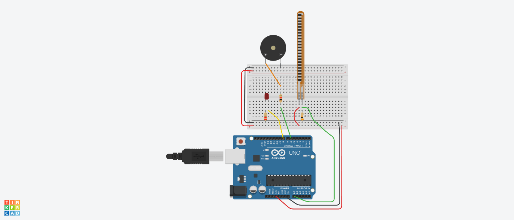
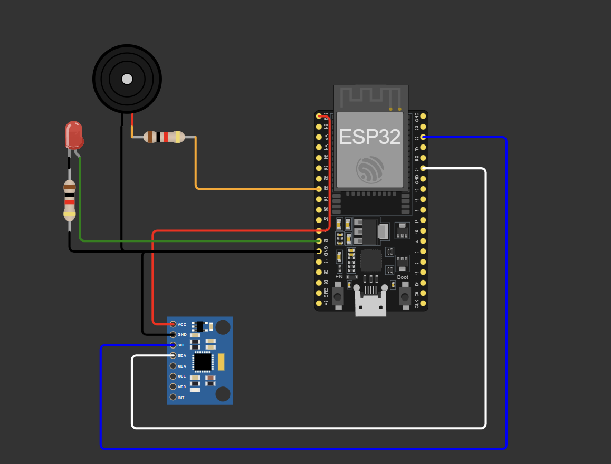

# Ohmies_IEEE_IH
# 🧍‍♂️ Smart Posture Monitoring System

This project is developed as part of the **IEEE Internal Hackathon** to address ergonomic health issues with a wearable posture monitoring system. The goal is to **improve user posture awareness** and reduce spinal or neck problems using affordable embedded technology.

---
## Teammates 
1) Sooryakanth Ramakrishnan -23BEE0083

2)Antara Tushar Prabhune -24BEE0109

3)Aarnav Ashok Rao -24BEE0079

## 🧠 Idea Summary

The Smart Posture Monitoring system ensures ergonomic safety through:

- **Body tilt detection** using MPU6050  
- **Neck bend detection** using Flex Sensor  
- **Real-time posture classification** into four levels  
- **Immediate alerts** using LED and buzzer for corrective action  
- Future scope: Bluetooth connectivity to a mobile app for data logging

---

## 🔧 Hardware Components Used

| Component       | Purpose                                |
|-----------------|----------------------------------------|
| ESP32           | Main controller (Wi-Fi/BLE capability) |
| MPU6050         | Body tilt detection (accelerometer + gyroscope) |
| Flex Sensor + Resistor | Neck bend detection (voltage divider) |
| Buzzer          | Poor posture audio alert               |
| LED             | Poor posture visual alert              |
| Jumper wires, breadboard | Connections setup            |

---

## 💡 Implementation Overview

### 🧍 Posture Logic (ESP32 + Sensors)

1. **MPU6050** measures the user’s body pitch angle to detect back posture.  
2. **Flex Sensor** measures neck bending via resistance change.  
3. Posture is classified into:
   - **Good**
   - **Moderately Bad**
   - **Bad**
   - **Very Bad**
4. Alerts:
   - **LED lights up** for visual notification
   - **Buzzer beeps** for immediate corrective action

---

## 📟 Serial Output Example

```plaintext
AnglePitch: 28.56
Flex Sensor ADC: 712
BAD POSTURE
```
## Prerequisites

-[Git](https://git-scm.com/)
-[Arduino](https://www.arduino.cc/en/software/)

## ⚙️ **Setup Instructions**

1. **Clone the repository**

```bash
git clone https://github.com/soorya-5002/Ohmies_IEEE_IH.git
cd Ohmies_IEEE_IH
```
## Link for online simulations 
-[TinkerCad_Flex](https://www.tinkercad.com/things/eKEjw6xYc0x-ieeeihflexsensor-/editel?returnTo=https%3A%2F%2Fwww.tinkercad.com%2Fdashboard%2Fdesigns%2Fcircuits)

-[Wokwi_MPU](https://wokwi.com/projects/434751258011689985)



