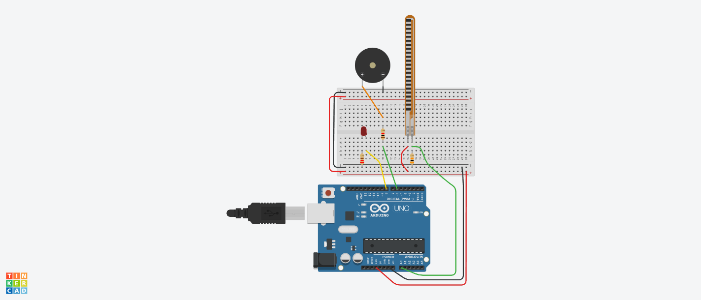
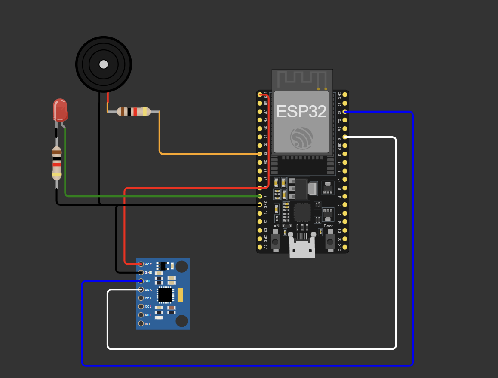

# Ohmies_IEEE_IH
# 🧍‍♂️ Posture Monitoring System

A wearable posture monitoring device built using **ESP32**, **MPU6050**, and a **flex sensor** to detect and classify different levels of spinal posture. The system alerts the user in real time using a **buzzer** and **LED**, helping improve ergonomic awareness and reduce health issues related to poor posture.

---

## 🚀 Current Status (Hackathon Submission)
- ✅ MPU6050 integrated and calibrated for pitch angle detection  
- ✅ Flex sensor added for neck bend monitoring  
- ✅ Real-time posture classification implemented (Good, Moderate, Bad, Very Bad)  
- ✅ Buzzer and LED alert system integrated  
- 🛠️ Threshold tuning & mobile connectivity in progress

---

## 📸 Demo Setup
> *(You can add an image here of your setup or schematic later)*  
- Sensor placement: back or neck region  
- Real-time feedback via LED and buzzer based on posture classification

---

## 🔧 Hardware Used
- ESP32 Dev Board  
- MPU6050 (Accelerometer + Gyroscope)  
- Flex Sensor (resistance-based bend sensor)  
- 10kΩ Resistor (for voltage divider with flex)  
- Piezo Buzzer  
- LED  
- Jumper wires, breadboard

---

## 💡 How It Works
1. **MPU6050** detects the user's body tilt using the pitch angle.
2. **Flex sensor** detects neck bending via resistance change.
3. Based on calibrated thresholds, posture is categorized into four levels:
   - **Good**
   - **Moderately Bad**
   - **Bad**
   - **Very Bad**
4. If poor posture is detected:
   - A **buzzer beeps** at a specific frequency.
   - An **LED lights up** to visually notify the user.

---
## 📟 Serial Output Example
```plaintext
AnglePitch: 28.56
Flex Sensor ADC: 712
BAD POSTURE
```
## Link to access Projects online 
-[TinkerCad-Flex sensor](https://www.tinkercad.com/things/eKEjw6xYc0x-ieeeihflexsensor-/editel?returnTo=https%3A%2F%2Fwww.tinkercad.com%2Fdashboard%2Fdesigns%2Fcircuits)

-[Wokwi-Mpu](https://wokwi.com/projects/434751258011689985)


## 🧩 Prerequisites

- [Git](https://git-scm.com/)  
- [Arduino IDE](https://www.arduino.cc/en/software) with ESP32 board support installed


### 📚 Libraries Used

Ensure these libraries are available in **Arduino IDE ➔ Library Manager**:

- `Wire`  
- **ESP32 BLE Libraries (inbuilt):**
  - `BLEDevice`
  - `BLEServer`
  - `BLEUtils`
  - `BLE2902`
  - `BLE2901`

> 🔎 **Note:** The BLE libraries listed above are **part of the ESP32 Arduino core**. No separate installation is needed if you have the **ESP32 board support package** installed in Arduino IDE.

---

## 📦 Setup

1. **Clone the repository:**

   ```bash
   git clone https://github.com/soorya-5002/Ohmies_IEEE_IH.git
   cd Ohmies_IEEE_IH
